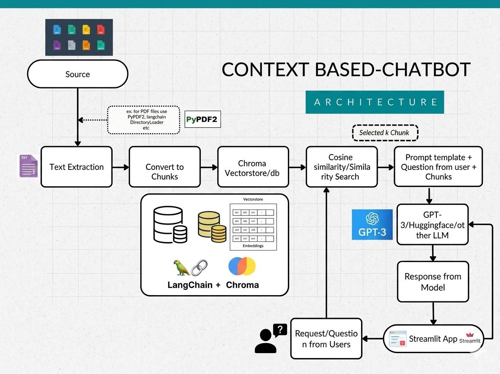

# WhatsBot 🤖💬
### Domain-Specific FAQ Chatbot Built from WhatsApp Group Chat Export Using Local LLMs


---

## Table of Contents
- [Introduction](#introduction)
- [Technologies Used](#technologies-used)
- [Architecture](#architecture)
- [System Components](#system-components)
- [Methodology](#methodology)
- [Project Structure](#project-structure)
- [Installation](#installation)
- [Usage](#usage)
- [Privacy & Security](#privacy--security)
- [Troubleshooting](#troubleshooting)
- [Roadmap](#roadmap)
- [Author](#author)

---

## Introduction

WhatsBot is a domain-specific FAQ chatbot that transforms a WhatsApp group chat export into an intelligent, locally-running AI agent using Retrieval-Augmented Generation (RAG), Conversational Thread Intelligence (CTI), and a Conversational Memory Graph (CMG).

Every WhatsApp group — whether a college department, office team, or community — accumulates thousands of messages containing valuable knowledge. This knowledge gets buried, repeated, or lost entirely. WhatsBot solves this by mining the group's full chat history, understanding conversation threads, tracking who said what and how reliable they are, detecting when answers have been corrected, and serving accurate, grounded answers through a WhatsApp-themed chat interface.

**No API keys. No cloud services. No cost. No data leaves your device.**

---

## Technologies Used

| Technology | Purpose |
|---|---|
| Python 3.10+ | Core application logic |
| Ollama | Local LLM serving runtime |
| Mistral 7B | Q&A extraction + answer generation |
| BGE-M3 | Multilingual text-to-vector embeddings (100+ languages) |
| ChromaDB | Persistent vector database with duplicate detection |
| Streamlit | Multi-page WhatsApp-themed chat UI |

---

## Architecture

WhatsBot follows a three-phase pipeline — parse, extract + analyze, and query:

**Phase 1 — Ingestion**
```
WhatsApp Export (chat.txt)
        ↓
parse_chat.py → Cleans messages, creates sliding windows of 5
        ↓
thread_analyzer.py → CTI: detects Q&A threads, validations, corrections, unanswered questions
        ↓
extract_qa.py → CTI pairs + Mistral 7B LLM fallback extraction
        ↓
build_vectorstore.py → Deduplication → BGE-M3 embeds Q&A → stored in ChromaDB
        ↓
build_graph.py → CMG: builds person authority graph + topic graph + contradiction log
        ↓
Knowledge Base + Memory Graph Ready ✅
```

**Phase 2 — Querying (real-time)**
```
User Question
        ↓
BGE-M3 → Embeds the question as a vector
        ↓
ChromaDB → Retrieves top 3 semantically similar Q&A pairs (with trust scores)
        ↓
Mistral 7B → Generates a grounded, context-aware answer
        ↓
WhatsBot UI → Displays answer in WhatsApp-styled chat interface
```

---

## System Components

| Component | File | Function |
|---|---|---|
| Chat Parser | `parse_chat.py` | Cleans and chunks raw WhatsApp export |
| Thread Analyzer | `thread_analyzer.py` | CTI engine — detects conversation threads, validations, corrections, and unanswered questions |
| Q&A Extractor | `extract_qa.py` | Runs CTI first, then Mistral 7B as LLM fallback for broader extraction |
| Vector Store | `build_vectorstore.py` | Deduplicates, embeds with BGE-M3, and persists Q&A pairs with trust metadata in ChromaDB |
| Memory Graph | `build_graph.py` | CMG engine — builds person authority graph, topic graph, and contradiction detector |
| RAG Engine | `chatbot.py` | Retrieves context and generates answers via Mistral 7B |
| Pipeline Runner | `main.py` | Runs the full ingestion pipeline; supports incremental update and `--rebuild` flag |
| Chat Interface | `app.py` | Multi-page Streamlit UI with WhatsApp theme |

---

## Methodology

<p align="center">
  
</p>

**Step 1 — Data Parsing**
The WhatsApp `.txt` export is parsed using regex to extract sender names, timestamps, and message text. System messages, media omissions, and very short messages are filtered out. Messages are grouped using a sliding window of 5 to preserve conversational context.

**Step 2 — Conversational Thread Intelligence (CTI)**
Before any LLM is involved, `thread_analyzer.py` scans the raw messages to detect natural conversation threads. It identifies which messages are questions, which are answers, and which are validations (e.g. "✅ confirmed", "ok noted") or corrections (e.g. "actually", "updated", "postponed"). Each thread is scored for trustworthiness based on the number of answers, validations, and whether a correction occurred. Unanswered questions are automatically written to `unanswered.txt`.

```
Thread detected:
  Q: "When is the assignment deadline?"          [sender: Student]
  A: "Friday (20/02/2026)"                       [sender: Rep, trust: 0.4]
  C: "Updated — new deadline is 25/02/2026"      [sender: Rep, correction flagged ⚠️]
```

**Step 3 — LLM Fallback Extraction (Mistral 7B)**
After CTI, Mistral 7B runs as a fallback pass over the same messages to catch anything CTI missed — birthdays, announcements, event dates, shared links, and implicit facts — returning them as structured JSON. Both CTI pairs and LLM pairs are merged for storage.

```
Input  → "[15/03/2025] Admin: Exam is on March 20th at 9 AM"
Output → {"question": "When is the exam?", "answer": "March 20th at 9 AM", "sender": "Admin"}

Input  → "[10/01/2025] Members: Happy Birthday Priya! 🎉"
Output → {"question": "When is Priya's birthday?", "answer": "January 10th", "sender": "Members"}
```

**Step 4 — Deduplication + Vector Embedding (BGE-M3)**
Before storing, each Q&A pair is checked against existing ChromaDB entries. Pairs with ≥90% semantic similarity are skipped. Each new pair is also pre-tested for embedding safety (NaN/Inf detection) before being written. Accepted pairs are embedded using BGE-M3 — a multilingual model supporting 100+ languages with dense, sparse, and multi-vector retrieval — and persisted under `faq_db/` along with CTI metadata: trust score, validation count, correction flag, and correction note.

**Step 5 — Conversational Memory Graph (CMG)**
After ingestion, `build_graph.py` builds three interconnected data structures from all extracted Q&A pairs. The **person graph** tracks each sender's answer count, topics covered, activity timeline, and assigns a detected role (Member → Active Member → Representative → Admin) with an authority score. The **topic graph** maps how frequently each topic is asked, which answers have the highest-authority source, and which topics share common responders. The **contradiction log** flags topics where different date-bearing answers conflict over time — for example, if an assignment deadline was stated as two different dates by the same or different senders.

**Step 6 — Retrieval-Augmented Generation**
At query time, the user's question is embedded using BGE-M3 and compared against the vector store. The top 3 closest matches are retrieved along with their trust metadata and passed as context to Mistral 7B, which generates a final natural-language answer grounded in the group's actual conversations.

---

## Project Structure

```
whatsbot/
│
├── chat.txt                  # WhatsApp exported chat (user input)
├── parse_chat.py             # Phase 1 — Parse and clean chat export
├── thread_analyzer.py        # CTI — detect threads, validations, corrections, unanswered Qs
├── extract_qa.py             # CTI + LLM fallback Q&A extraction
├── build_vectorstore.py      # Deduplicate, embed with BGE-M3, store in ChromaDB
├── build_graph.py            # CMG — person authority graph, topic graph, contradiction log
├── chatbot.py                # RAG query engine
├── main.py                   # Full pipeline runner (incremental + --rebuild modes)
├── app.py                    # Multi-page Streamlit WhatsApp-themed UI
│
├── faq_db/                   # ChromaDB persistent vector store (auto-generated)
├── person_graph.json         # CMG person authority data (auto-generated)
├── topic_graph.json          # CMG topic map with answer history (auto-generated)
├── contradiction_log.json    # Detected answer conflicts (auto-generated)
├── last_processed.json       # Incremental update checkpoint (auto-generated)
├── schedule_log.txt          # Scheduled rebuild event log (auto-generated)
├── unanswered.txt            # Questions WhatsBot couldn't answer (auto-generated)
│
└── README.md
```

---

## Installation

### Prerequisites
- Python 3.10 or higher
- [Ollama](https://ollama.com) installed
- 8GB RAM minimum (16GB recommended)
- ~6GB free disk space for models

### 1. Clone the Repository
```bash
git clone https://github.com/YOUR_USERNAME/whatsbot.git
cd whatsbot
```

### 2. Pull AI Models *(one-time, requires internet)*
```bash
ollama pull mistral
ollama pull bge-m3
```

### 3. Install Python Dependencies
```bash
pip install chromadb requests streamlit schedule
```

### 4. Export Your WhatsApp Chat
On your phone:
1. Open the WhatsApp group → tap ⋮ → **More** → **Export Chat**
2. Select **Without Media**
3. Send to yourself → download → rename to `chat.txt`
4. Place `chat.txt` inside the project folder

### 5. Build the Knowledge Base
```bash
python main.py
```

Expected output:
```
🤖 WhatsBot CMG Pipeline Starting...

Step 1: Parsing chat...
  Found 342 messages

Step 2: Running CTI + LLM Extraction...
  🧵 Running CTI Thread Analysis...
  📊 CTI Results:
     Threads found    : 58
     Answered         : 44
     Unanswered       : 14 (logged to unanswered.txt)
     Corrections found: 3
     Validated answers: 12
     Q&A pairs from CTI: 44
  🤖 LLM fallback pairs: 61
  ✅ Total combined Q&A pairs: 105

Step 3: Storing in vector database...
  Stored       : 98 new Q&A pairs
  Skipped      : 7 duplicates or empty
  Total in DB  : 98
  Embedding model: bge-m3 (100+ languages)

Step 4: Building Conversational Memory Graph (CMG)...
  ✅ CMG Complete:
     People tracked : 12
     Topics mapped  : 9
     Contradictions : 1

✅ Done! Run: python -m streamlit run app.py
```

> ⏱️ This step may take 15–40 minutes depending on chat size.

### 6. Launch WhatsBot
```bash
python -m streamlit run app.py
```

Open your browser at: **http://localhost:8501**

To force a full rebuild from scratch:
```bash
python main.py --rebuild
```

---

## Usage

| Page | How to use |
|---|---|
| 💬 Chat | Type any question and press Enter, or tap a Quick Question button |
| 🧠 CMG Intelligence | View authority leaderboard, trending topics, contradictions, and answer evolution timeline |
| 🛠️ Admin Panel | Browse FAQ entries with trust scores, view corrections, review unanswered questions |
| 🔄 Update Knowledge Base | Run incremental update or force full rebuild after replacing `chat.txt` |
| 📋 FAQ Report | Generate and download an HTML report of the full knowledge base and CMG stats |
| ⏰ Scheduled Rebuild | Set WhatsBot to auto-rebuild daily, hourly, or every minute |
| 🔒 Anonymous Mode | Toggle from the sidebar to hide all sender names |

---

## Privacy & Security

| Concern | How WhatsBot Handles It |
|---|---|
| Chat data | Never sent to any external server |
| API keys | Not required — zero external API calls |
| Internet | Only needed once for model download |
| Storage | All data stays on your local disk only |
| Network | All calls go to `localhost:11434` (your own machine) |
| Sender names | Can be hidden globally using Anonymous Mode |

> Turn off your WiFi and WhatsBot still works. Everything runs locally.

---

## Troubleshooting

| Error | Fix |
|---|---|
| `ollama not found` | Restart terminal after Ollama installation |
| `connection refused` | Open a new terminal and run `ollama serve` |
| `chat.txt not found` | Ensure the file is in the project root folder |
| `chromadb error` | Run `pip install chromadb --upgrade` |
| `streamlit not found` | Use `python -m streamlit run app.py` |
| `schedule not found` | Run `pip install schedule` |
| BGE-M3 NaN embedding errors | WhatsBot auto-skips unsafe embeddings — check for unusual characters in chat |
| No Q&A extracted | Your chat date format may differ — open an issue with a sample line |

---

## Roadmap

- [x] Core RAG pipeline (parse → extract → embed → query)
- [x] Conversational Thread Intelligence (CTI) — thread detection, validations, corrections
- [x] Conversational Memory Graph (CMG) — authority scoring, topic mapping, contradiction detection
- [x] BGE-M3 multilingual embeddings (100+ languages)
- [x] Duplicate detection with semantic similarity
- [x] Rich extraction (birthdays, events, deadlines, announcements)
- [x] Multi-page UI (Chat, CMG Intelligence, Admin, Update, Report, Schedule)
- [x] Trust scores and correction flags per FAQ entry
- [x] Unanswered questions log
- [x] Scheduled auto-rebuild
- [x] Incremental update + `--rebuild` flag
- [x] FAQ HTML report export
- [x] Anonymous mode
- [x] Multi-language support (Tamil, Hindi, English, and more)
- [ ] Drag-and-drop chat file upload in UI
- [ ] Support for multiple group chats
- [ ] Docker deployment
- [ ] Export knowledge base as PDF

---

## Author

**S. Sruti** — B.Tech. Information Technology

**Kavi Nisha MP** — B.Tech. Artificial Intelligence and Data Science

---

*Built using open-source AI tools — completely free, completely private.*

> **WhatsBot — Because no one should have to answer the same question twice.**


